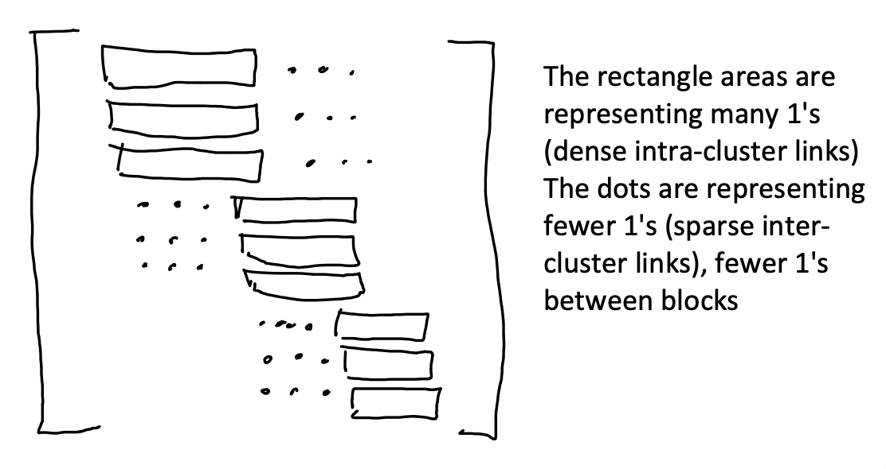
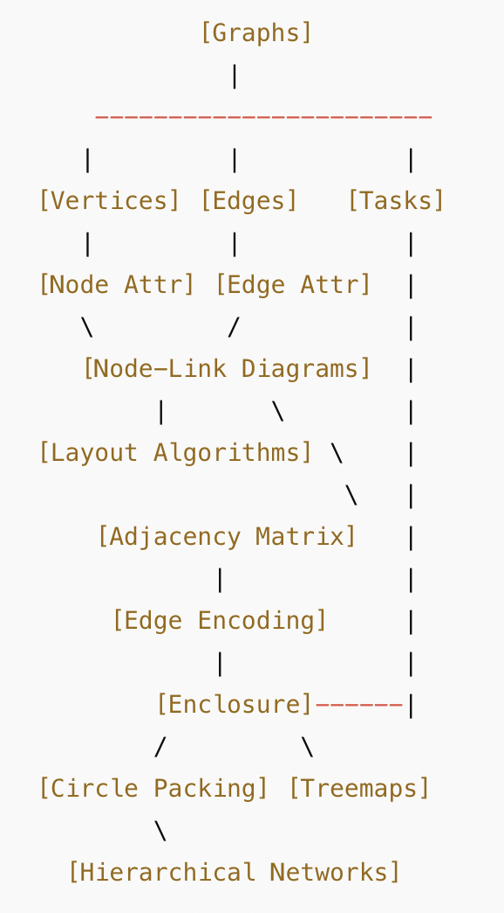

```{r, echo = FALSE}
knitr::opts_chunk$set(warnings = FALSE, message = FALSE)
```

<!--install.packages(c(
  "tidyverse",   # Includes dplyr, ggplot2, readr, etc.
  "tidymodels",  # For recipe, normalization, PCA, modeling
  "patchwork",   # For combining ggplots (used earlier)
  "ggraph",      # For network visualization
  "tidygraph",   # For graph data structures
  "cluster",     # For clustering
  "Matrix"       # Optional: for matrix visualizations
))-->

> Code Diary

a. What was your programming environment/workflow?
I primarily worked in RStudio using an RMarkdown notebook. This allowed me to write code, test it, and write explanations inline, which helped keep everything organized. I also used the built-in plot viewer to check visual outputs quickly.

b. What techniques did you use to plan your code?
Before writing full code, I often sketched out what each chunk needed to do in the comments — kind of like inline pseudocode. For multi-step problems (like PCA or clustering), I broke them down into steps like "prep data," "run analysis," and "visualize." I also asked ChatGPT for help debugging and structuring some complex steps.

c. What kinds of bugs did you encounter? What steps did you take to resolve them?
I ran into errors with variable names after cleaning column names using janitor::clean_names(), which changed column references unexpectedly. I also had issues with update_role() in tidymodels when columns didn’t exist. To fix these, I printed colnames() frequently to double-check column names and used mutate() instead of bind_cols() when merging data. I also carefully read error messages and Googled specific errors when needed.

d. If you were starting the programming task again, would you do anything differently?
Yes — I would start by printing and checking column names earlier in the process to avoid errors later. I’d also write a small test plot or two early in a problem to confirm the structure before building the full visualization. Lastly, I’d rely a little less on trial-and-error and instead consult documentation sooner when trying new functions.


> Geospatial Datasets 

a. NYC Building Footprints
Type: Vector
Geometry: Polygon
Reasoning: Building footprints represent the physical outline of buildings, which are best represented as polygons in vector data.

b. Africa Population 2020
Type: Raster
Reasoning: Population data over a large area like a continent is typically distributed across a grid, with each pixel representing population density or count. This is raster-based.

c. Himalayan Glacial Lakes
Type: Vector
Geometry: Polygon or Point
Reasoning: Each lake can be represented as a polygon (to show the surface area) or sometimes as a point (if only the location is needed). Most detailed datasets use polygons.

d. Wisconsin EV Charging
Type: Vector
Geometry: Point
Reasoning: Charging stations are individual locations, best represented as points in a vector format.

e. Zion Elevation
Type: Raster
Reasoning: Elevation is continuous data and is best represented as a raster (like a Digital Elevation Model), where each cell has an elevation value.

```{r}

library(osmdata)
library(sf)
library(ggplot2)

wi_ev <- opq("Wisconsin") %>%
  add_osm_feature(key = "amenity", value = "charging_station") %>%
  osmdata_sf()

ggplot(data = wi_ev$osm_points) +
  geom_sf(color = "blue", size = 1) +
  ggtitle("EV Charging Stations in Wisconsin") +
  theme_minimal()

```


> CalFresh Comparison 

a. Graphical encoding refers to the way data values are visually represented in a plot or chart using properties like position, color, size, shape, or angle. These encodings help viewers interpret patterns, trends, and comparisons in the data.

Example: In a line plot, time might be encoded on the x-axis (position), and unemployment rate on the y-axis. Each line might be colored by year — color is the graphical encoding used to distinguish time series.

b. Approach 1: Small Multiples of Line Charts
This approach uses individual line charts to display unemployment trends over time for a selected set of counties. A major strength of this method is its clarity in tracking temporal trends for each county. Viewers can easily compare how unemployment fluctuates month-by-month and year-by-year within a single county. The use of color to encode the year helps in identifying changes across time. Additionally, the small multiples format prevents visual clutter by isolating each county into its own subplot, making patterns like the unemployment spike in 2020 very easy to spot.

However, a significant weakness of this approach is its limited geographic coverage. It only includes a small, predefined subset of counties, so it doesn't offer a comprehensive view of unemployment across the entire state. This restricts its usefulness for exploring regional or statewide patterns. Moreover, if more counties were added, the layout could become visually overwhelming or difficult to navigate. Also, comparing trends between counties is less straightforward since each is plotted separately with potentially varying scales or emphasis.

Approach 2: Heatmap of Counties Over Time
The second approach displays unemployment using a heatmap, where each row represents a county and each column represents a month across multiple years. The primary strength of this method is that it allows users to quickly scan for patterns across space and time. It's especially powerful for detecting high-level trends, such as which counties had persistently high or low unemployment or how widespread the unemployment spike in 2020 was. It supports both vertical (county-wise) and horizontal (time-wise) comparisons at a glance.

On the downside, the heatmap format sacrifices granular interpretability for density. It's often difficult to determine exact unemployment values due to reliance on color gradients, and slight differences in unemployment rates may not be easily distinguished. Also, color encodings (like square-root scaled shading) can be unintuitive or misleading without careful labeling. For someone unfamiliar with the color mapping, it can be hard to grasp the magnitude of unemployment change across time or counties without cross-referencing the color legend repeatedly.

Approach 3: Choropleth Maps by Year
This visualization shows choropleth maps of California by year, with counties shaded according to their maximum unemployment rate. The greatest strength of this approach is its ability to clearly convey geographic patterns. It's ideal for visualizing spatial clusters or regional differences — for instance, how certain inland counties experience much higher unemployment than coastal ones. Faceting by year allows viewers to observe how these geographic patterns shift over time, giving a strong sense of how widespread or localized unemployment issues are.

The main weakness of this method is its lack of temporal granularity. Because it aggregates each year to a single “maximum unemployment” value, it hides within-year variation, such as seasonal unemployment spikes or short-term shocks. Additionally, side-by-side maps can become difficult to compare accurately due to subtle shading differences, especially if color bins are too wide or too narrow. Without interactive tools, it's also harder to compare specific values between years or counties unless clearly labeled.

c.
```{r}
library(sf)
library(dplyr)
library(lubridate)

# Load the dataset (adjust path if needed)
unemployment <- read_sf("unemployment.geojson") %>%
  mutate(date = as.Date(date))  # make sure 'date' is Date type

# Ensure 'year' column exists (in case it's missing or needs extraction)
unemployment_summary <- unemployment %>%
  mutate(year = year(date)) %>%
  group_by(county, year) %>%
  summarise(max_unemployment = max(unemployment, na.rm = TRUE)) %>%
  ungroup()

# View the first few rows
head(unemployment_summary)

```

d. Implementing approach 3
```{r}
library(ggplot2)
library(sf)

# Plot max unemployment per county for each year
ggplot(unemployment_summary) +
  geom_sf(aes(fill = max_unemployment), color = "white", size = 0.1) +
  facet_wrap(~year) +
  scale_fill_viridis_c(name = "Max Unemployment", option = "C", direction = -1) +
  labs(
    title = "Maximum Unemployment by County (2014–2020)",
    caption = "Data Source: unemployment.geojson"
  ) +
  theme_minimal() +
  theme(
    strip.text = element_text(size = 10, face = "bold"),
    axis.text = element_blank(),
    axis.ticks = element_blank()
  )

```

> HIV Network

a. 

loading the data
```{r}
library(tidygraph)
library(ggraph)
library(readr)
library(dplyr)

# Load nodes and edges
nodes <- read_csv("https://github.com/krisrs1128/stat436_s25/raw/refs/heads/main/data/hiv_nodes.csv")
edges <- read_csv("https://github.com/krisrs1128/stat436_s25/raw/refs/heads/main/data/hiv_edges.csv")

# Create graph object
G <- tbl_graph(nodes = nodes, edges = edges, directed = FALSE)

```

```{r}
library(ggplot2)

# Draw the graph with ggraph
ggraph(G, layout = "fr") +  # Fruchterman-Reingold layout for clarity
  geom_edge_link(alpha = 0.2, edge_color = "gray70") +
  geom_node_point(aes(color = name), size = 2, alpha = 0.8) +
  geom_node_text(aes(label = name), size = 2, repel = TRUE, alpha = 0.7) +
  theme_void() +
  guides(color = "none") +  # Hide legend to reduce clutter
  ggtitle("HIV Sequence Network: Node-Link Diagram by Country")

```

b.adj matrix
```{r}
library(igraph)

# Define edges
edges <- matrix(c(
  1, 2,
  1, 3,
  1, 5,
  2, 4
), byrow = TRUE, ncol = 2)

# Create undirected graph
g <- graph_from_edgelist(edges, directed = FALSE)

# Create adjacency matrix
adj_matrix <- as.matrix(as_adjacency_matrix(g))
adj_matrix

```

c. The adjacency matrix would show three dense diagonal blocks representing tight connections within clusters, with sparser off-diagonal values indicating limited links between clusters — reflecting the community structure seen in the node-link diagram.

```{r fig.align='center', echo=FALSE, out.width="70%"}

```
Adjacency matrix is symmetric, block diagonal with dense intra-cluster blocks. 
Sparse off-diagonal entries reflect the minimal inter-cluster connections.
In example visually, the matrix has three dense squares and a few off-block connections.


> Beijing Air Pollution

a.
```{r beijing-cluster, message=FALSE, warning=FALSE}
library(tidyverse)
library(cluster)
library(ggplot2)

# Load your data
beijing <- read_csv("pollution_wide.csv")

# Scale pollution, temp, and windspeed hourly columns
data_scaled <- beijing %>%
  select(matches("pollution_\\d+|temp_\\d+|wndspd_\\d+")) %>%
  scale()

# Perform hierarchical clustering
d <- dist(data_scaled)
hc <- hclust(d)
beijing$cluster <- cutree(hc, k = 10)

# Convert to long format for visualization
beijing_long <- beijing %>%
  select(cluster, matches("pollution_\\d+|temp_\\d+|wndspd_\\d+")) %>%
  pivot_longer(
    cols = -cluster,
    names_to = c("type", "hour"),
    names_pattern = "(.*)_(\\d+)",
    values_to = "value"
  ) %>%
  mutate(hour = as.numeric(hour))

# Summarize quantiles per cluster, type, and hour
cluster_summary <- beijing_long %>%
  group_by(cluster, type, hour) %>%
  summarise(
    q25 = quantile(value, 0.25),
    q50 = quantile(value, 0.50),
    q75 = quantile(value, 0.75),
    .groups = "drop"
  )

# Ribbon plot
ggplot(cluster_summary, aes(x = hour)) +
  geom_ribbon(aes(ymin = q25, ymax = q75, fill = as.factor(cluster)), alpha = 0.3) +
  geom_line(aes(y = q50, color = as.factor(cluster))) +
  facet_wrap(~type, scales = "free_y") +
  labs(
    title = "Clustered Daily Air Pollution Patterns in Beijing",
    x = "Hour of Day", y = "Value",
    fill = "Cluster", color = "Cluster"
  ) +
  theme_minimal()

```

Interpretation:

The ribbon plot reveals 10 distinct daily profiles of pollution, temperature, and windspeed patterns in Beijing from 2010 to 2014. Several clusters exhibit clear morning and evening pollution peaks, likely driven by traffic congestion and low wind conditions. Other clusters show stable or low pollution levels throughout the day, often associated with higher daytime temperatures or consistent wind speeds, which support atmospheric dispersion. Clusters with narrow ribbons suggest typical, consistent daily patterns, while wider ribbons highlight more variable or extreme weather and pollution conditions across different days.


> Food Nutrients 

a. 
```{r pca-airpollution, message=FALSE, warning=FALSE}
library(tidyverse)
library(tidymodels)

# Load the dataset
pollution <- read_csv("pollution_wide.csv")

# Define PCA recipe (excluding date)
pca_recipe <- recipe(~ ., data = pollution) %>%
  update_role(date, new_role = "id") %>%
  step_normalize(all_numeric_predictors()) %>%
  step_pca(all_numeric_predictors())

```

b. 
```{r pca-loadings-plot-final, message=FALSE, warning=FALSE}
library(tidyverse)
library(tidymodels)
library(janitor)

# Load and clean the data
nutrients <- read_csv("https://uwmadison.box.com/shared/static/nmgouzobq5367aex45pnbzgkhm7sur63.csv") %>%
  clean_names()

# Define and prep the PCA recipe
pca_recipe <- recipe(~ ., data = nutrients) %>%
  update_role(name, group, group_lumped, new_role = "id") %>%
  step_normalize(all_numeric_predictors()) %>%
  step_pca(all_numeric_predictors(), num_comp = 6)

pca_prep <- prep(pca_recipe)

# Extract the PCA step safely
pca_step <- pca_prep$steps[[which(map_chr(pca_prep$steps, ~ class(.x)[1]) == "step_pca")]]

# Get loadings and reshape
pca_loadings <- pca_step$res$rotation %>%
  as.data.frame() %>%
  rownames_to_column(var = "nutrient") %>%
  pivot_longer(cols = starts_with("PC"), names_to = "component", values_to = "value")

# Plot top 6 components
ggplot(pca_loadings %>% filter(component %in% paste0("PC", 1:6)),
       aes(x = value, y = reorder(nutrient, value))) +
  geom_col() +
  facet_wrap(~component, scales = "free_x") +
  labs(
    title = "Top 6 Principal Components: Nutrient Loadings",
    x = "Loading Value",
    y = "Nutrient"
  ) +
  theme_minimal()


```

PC1 appears to separate foods based on water vs. fat content: foods with high PC1 have more fat and calories, while low PC1 is associated with higher water content.
PC2 differentiates protein- and mineral-rich foods (e.g., dairy, meat) from sugar- or carb-heavy ones (e.g., fruits, snacks).
I would expect meats and dairy to have high PC2 scores, and sweets or juices to have low PC2.

c.
```{r pca-part-c-final-fixed, message=FALSE, warning=FALSE}
# Get PCA scores
pca_scores <- bake(pca_prep, new_data = NULL)

# Add the group column safely (same row order)
pca_scores_with_group <- pca_scores %>%
  mutate(group = nutrients$group)

# Compute and sort average PC2 by group
avg_pc2_by_group <- pca_scores_with_group %>%
  group_by(group) %>%
  summarize(avg_pc2 = mean(PC2, na.rm = TRUE)) %>%
  arrange(desc(avg_pc2))

# Print results
avg_pc2_by_group


```

d.
```{r pca-part-d, message=FALSE, warning=FALSE}
library(forcats)

# Use PC scores and join group column (already done in part c)
pca_scores_with_group <- pca_scores %>%
  mutate(group = nutrients$group)

# Reorder group factor based on average PC2
group_order <- pca_scores_with_group %>%
  group_by(group) %>%
  summarize(avg_pc2 = mean(PC2, na.rm = TRUE)) %>%
  arrange(desc(avg_pc2)) %>%
  pull(group)

# Apply order to facet variable
pca_scores_with_group <- pca_scores_with_group %>%
  mutate(group = factor(group, levels = group_order))

# Plot PC1 vs PC2, faceted by group (ordered)
ggplot(pca_scores_with_group, aes(x = PC1, y = PC2)) +
  geom_point(alpha = 0.6, size = 1.5) +
  facet_wrap(~ group, scales = "free") +
  labs(
    title = "PCA Scores by Food Group (Faceted by Group, Ordered by PC2)",
    x = "PC1",
    y = "PC2"
  ) +
  theme_minimal() +
  theme(strip.text = element_text(size = 9))

```

The groups with high PC2 values in part (c) — such as Fats and Oils and Meats — appear higher in the PC2 dimension in the plots, confirming our interpretation in part (b). Similarly, groups like Sweets and Cereals show lower PC2 scores, suggesting higher sugar or carb content. This visual comparison supports our PCA findings.


> Concept Map

Concept Map for Week 8: Networks and Visualization Strategies

Nodes (Concepts):

- Graphs
- Vertices (Nodes)
- Edges (Links)
- Directed vs Undirected Edges
- Node Attributes
- Edge Attributes
- Tasks on Networks
- Network Examples
- Trees
- Node-Link Diagrams
- Layout Algorithms
- Adjacency Matrix
- Edge Bundling
- Enclosure (Containment)
- Circle Packing
- Treemaps
- Hierarchical Networks

Edges (Connections): 

Graphs → Vertices: Every graph is made of nodes (or vertices) that represent entities.

Graphs → Edges: Edges represent relationships between nodes in the graph.

Edges → Directed vs Undirected: Edge directionality defines whether relationships have a flow or are symmetric.

Vertices → Node Attributes: Nodes can have properties like size, label, or group (e.g., file size, person name).

Edges → Edge Attributes: Edges can have weights (e.g., strength of connection, duration of contact).

Graphs → Tasks on Networks: Common tasks include identifying clusters, tracing paths, and finding key nodes.

Tasks on Networks → Network Examples: Examples like internet graphs, evolutionary trees, and disease networks highlight these tasks.

Graphs → Trees: Trees are a special case of graphs with hierarchical structure and no cycles.

Graphs → Node-Link Diagrams: A common way to visualize graphs using spatial layout and connecting lines.

Node-Link Diagrams → Layout Algorithms: Node positions are computed using layouts like force-directed (e.g., Kamada-Kawai).

Graphs → Adjacency Matrix: An alternative encoding of networks, useful for large/dense graphs.

Adjacency Matrix → Edge Attributes: Edge presence and weight can be encoded as matrix cell color/opacity.

Adjacency Matrix → Layout Algorithms: Sorting rows/columns influences interpretability.

Graphs → Enclosure: Used when nodes have nested/hierarchical relationships.

Enclosure → Circle Packing: Shows hierarchy by nesting nodes inside others.

Enclosure → Treemaps: Uses rectangular containment to visualize size/importance.

Node-Link Diagrams ↔ Adjacency Matrix: Complementary strategies—node-link is better for local paths, adjacency matrices for global structure.

Enclosure → Hierarchical Networks: Containment helps visualize nested communities or tree structures.

```{r fig.align='center', echo=FALSE, out.width="70%"}

```


